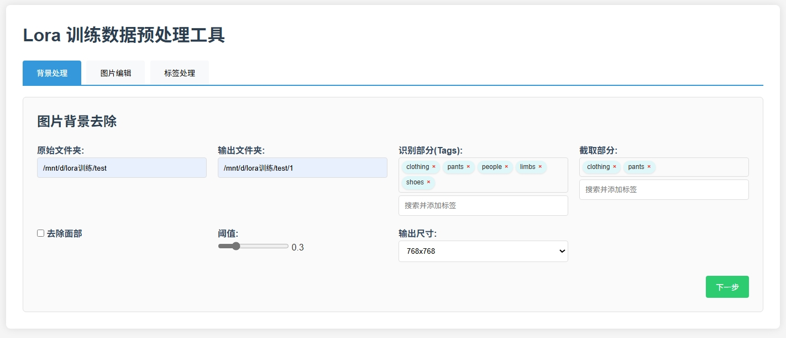
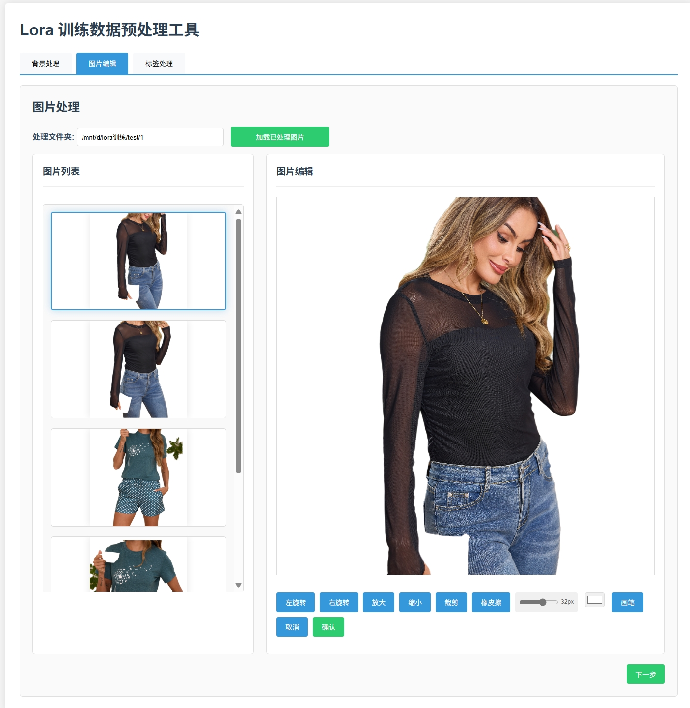
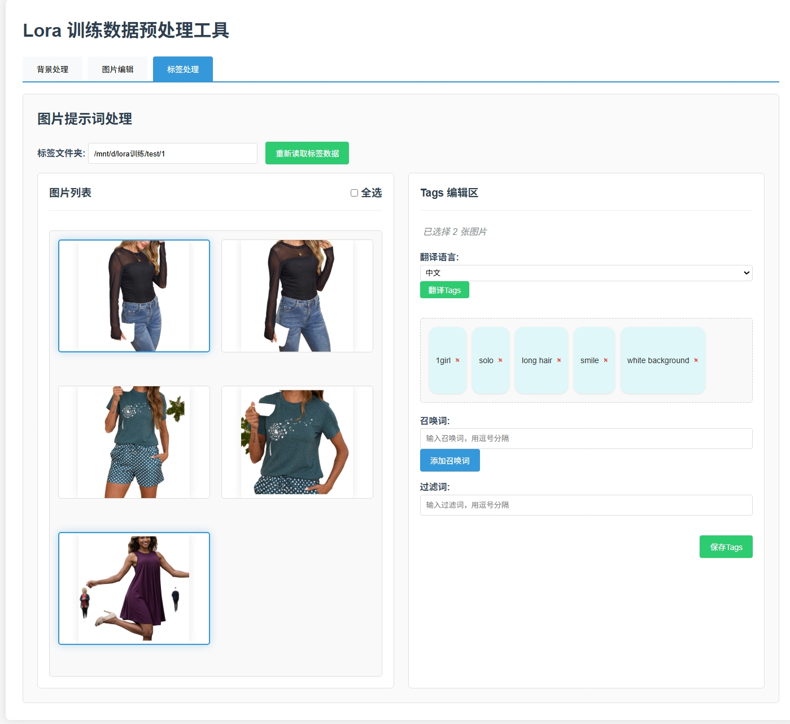

# lora-tool
lora图片背景/大小/tag处理工具，用于输出适合lora训练的图片
# 主要基于下面开源项目开发
1.segment-anything
2.grounding_dino
3.comfyui
4.MiaoshouAI
5.ComfyUI_LayerStyle
# 环境
1. python 3.10+
2. GPU 6GB+
# 项目结构
# 安装
1. 安装依赖
windows
```bash
intall.bat
```
linux
```bash
sh install.sh
```
2. 运行
windows
```bash
start.bat
```
linux
```bash
sh start.sh
```
3. 启动后打开 http://127.0.0.1:8000/ui

# 功能
1. 图片背景处理

2. 图片大小处理

3. 图片tag处理

