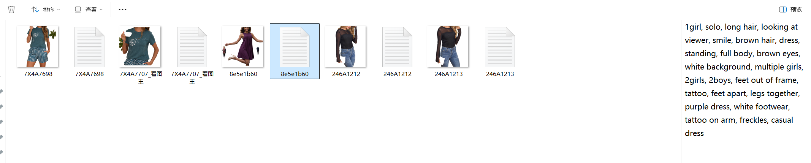

# lora-tool
lora图片背景/大小/tag处理工具，用于输出适合lora训练的图片
# 主要基于下面开源项目开发
1.segment-anything
2.grounding_dino
3.comfyui
4.MiaoshouAI
5.ComfyUI_LayerStyle
# docker部署
[docker.md](./doc/docker.md)
# 环境
1. python 3.10+
2. GPU 6GB+
# Windows 便携版
[发布页面](https://github.com/AndsGo/lora-tool/releases) 上有一个适用于 Windows 的便携独立版本，可以在 Nvidia GPU 上运行，也可以在您的 CPU 上运行。

[直接下载链接](https://github.com/AndsGo/lora-tool/releases/download/v1.0.0/setup.exe)
# 安装
1. 安装依赖
windows
```bash
intall.bat
```
linux
```bash
sh install.sh
```
2. 运行
windows
```bash
start.bat
```
linux
```bash
sh start.sh
```
3. 启动后打开 http://127.0.0.1:8000/ui

# 功能
1. 图片背景处理

2. 图片处理

我们可以图片处理，可以调整位置，擦除不需要的部分..
3. 图片tag处理


最后一步处理完成后，点击`保存tags`，会自动保存到`output`文件夹下。图片和tag文件通过文件名称一一对应。

# 注意
1. 图片大小处理时，会自动裁剪图片，裁剪后图片会自动保存到`output`文件夹下。
2. 图片tag处理时，会自动裁剪图片，裁剪后图片会自动保存到`output`文件夹下。
3. 图片tag处理时，会自动打标签，打标签后图片会自动保存到`output`文件夹下。


# API
[API文档](./doc/api.md)