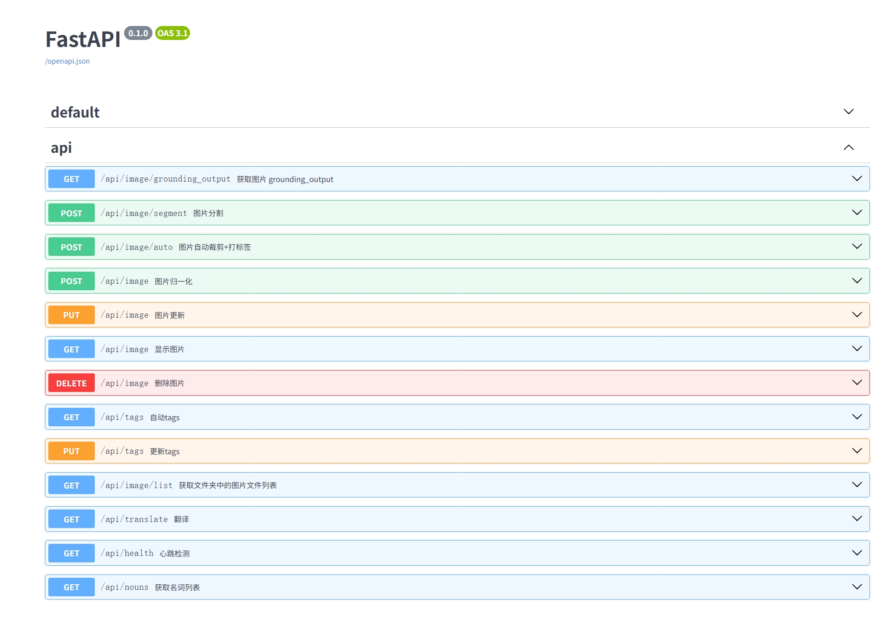

# API
由于本项目是通过`FastAPI`框架开发的，因此本项目的API文档可以通过`FastAPI`的文档生成器生成。
访问`/docs`即可查看API文档。
```
http://127.0.0.1:8000/docs
```


# FastAPI API 文档

> **版本：** 0.1.0

---

## 目录

- [前端页面](#前端页面)
- [图片相关接口](#图片相关接口)
  - [获取图片 grounding_output](#获取图片-grounding_output)
  - [图片分割](#图片分割)
  - [图片自动裁剪+打标签](#图片自动裁剪打标签)
  - [图片归一化](#图片归一化)
  - [图片更新](#图片更新)
  - [显示图片](#显示图片)
  - [删除图片](#删除图片)
  - [获取文件夹中的图片文件列表](#获取文件夹中的图片文件列表)
- [标签相关接口](#标签相关接口)
  - [自动tags](#自动tags)
  - [更新tags](#更新tags)
- [其他接口](#其他接口)
  - [翻译](#翻译)
  - [心跳检测](#心跳检测)
  - [获取名词列表](#获取名词列表)

---

## 前端页面

### GET `/ui`

- **描述**：前端页面
- **请求参数**：无
- **响应**
  - 200：成功

---

## 图片相关接口

### 获取图片 grounding_output

#### GET `/api/image/grounding_output`

- **描述**：获取图片 grounding_output
- **请求参数（Query）**
  - `classes` (array[string], 必填)：目标检测的提示词，多个类别用点号分隔。
  - `model` (string, 选填, 默认: `GroundingDINO_SwinT_OGC (694MB)`): 要使用的 GroundingDINO 模型类型。
  - `threshold` (number, 选填, 默认: 0.35)：目标检测的阈值，用于过滤检测结果。
  - `image_folder` (string, 必填)：检测的图片文件夹。

- **响应**
  - 200：成功
  - 404：未找到
  - 422：参数验证错误

---

### 图片分割

#### POST `/api/image/segment`

- **描述**：图片分割
- **请求参数（Query）**
  - `classes` (array[string], 必填)：目标检测的提示词，多个类别用点号分隔。
  - `model` (string, 选填, 默认: `GroundingDINO_SwinT_OGC (694MB)`): 要使用的 GroundingDINO 模型类型。
  - `threshold` (number, 选填, 默认: 0.35)：目标检测的阈值，用于过滤检测结果。
  - `image_folder` (string, 必填)：检测的图片文件夹。
- **请求体（FormData）**
  - `image` (file, 必填)：要分割的图片文件

- **响应**
  - 200：成功
  - 404：未找到
  - 422：参数验证错误

---

### 图片自动裁剪+打标签

#### POST `/api/image/auto`

- **描述**：图片自动裁剪+打标签
- **请求体（JSON）**

  ```json
  {
    "url": "string, 必填, 图片的URL地址",
    "filename": "string, 必填, 图片名称",
    "task_id": "string, 选填, 任务ID, 默认: task_id",
    "width": "integer/null, 选填, 归一化图片宽度, 默认: 768",
    "height": "integer/null, 选填, 归一化图片高度, 默认: 768",
    "broder": "integer/null, 选填, 图片边界, 默认: 20",
    "classes": "array[string]/null, 选填, 检测类别提示词, 默认: [face, clothing, pants, shoes, characters]",
    "reserves": "array[string]/null, 选填, 保留类别名, 默认: [clothing, pants]",
    "remove_face": "boolean/null, 选填, 是否去除头, 默认: true",
    "threshold": "number/null, 选填, 检测阈值, 默认: 0.35",
    "remove_tags": "array[string]/null, 选填, 去除标签, 默认: [face]",
    "add_tags": "array[string]/null, 选填, 添加标签, 默认: [white background]"
  }
  ```

- **响应**
  - 200：成功
  - 404：未找到
  - 422：参数验证错误

---

### 图片归一化

#### POST `/api/image`

- **描述**：图片归一化
- **请求体（JSON）**

  ```json
  {
    "input_folder": "string, 必填, 待处理图片文件夹",
    "output_folder": "string, 必填, 输出图片文件夹",
    "width": "integer/null, 选填, 归一化图片宽度, 默认: 768",
    "height": "integer/null, 选填, 归一化图片高度, 默认: 768",
    "broder": "integer/null, 选填, 图片边界, 默认: 20",
    "classes": "array[string]/null, 选填, 检测类别提示词, 默认: [face, clothing, pants, shoes, characters]",
    "reserves": "array[string]/null, 选填, 保留类别名, 默认: [clothing, pants]",
    "remove_face": "boolean/null, 选填, 是否去除头, 默认: true",
    "threshold": "number/null, 选填, 检测阈值, 默认: 0.35"
  }
  ```

- **响应**
  - 200：成功
  - 404：未找到
  - 422：参数验证错误

---

### 图片更新

#### PUT `/api/image`

- **描述**：图片更新
- **请求参数（Query）**
  - `folder_path` (string, 必填)：文件夹路径
  - `image_name` (string, 必填)：图片名

- **请求体（FormData）**
  - `file` (file, 必填)：图片文件

- **响应**
  - 200：成功
  - 404：未找到
  - 422：参数验证错误

---

### 显示图片

#### GET `/api/image`

- **描述**：显示图片
- **请求参数（Query）**
  - `image_path` (string, 必填)：图片路径

- **响应**
  - 200：成功
  - 404：未找到
  - 422：参数验证错误

---

### 删除图片

#### DELETE `/api/image`

- **描述**：删除图片
- **请求参数（Query）**
  - `image_path` (string, 必填)：图片路径

- **响应**
  - 200：成功
  - 404：未找到
  - 422：参数验证错误

---

### 获取文件夹中的图片文件列表

#### GET `/api/image/list`

- **描述**：获取指定文件夹中的图片文件列表
- **请求参数（Query）**
  - `folder_path` (string, 必填)：文件夹路径

- **响应**
  - 200：成功
  - 404：未找到
  - 422：参数验证错误

---

## 标签相关接口

### 自动tags

#### GET `/api/tags`

- **描述**：自动tags
- **请求参数（Query）**
  - `folder` (string, 必填)：标签的图片文件夹
  - `remove_tags` (array[string]/null, 选填, 默认: [face])：去除的标签
  - `add_tags` (array[string]/null, 选填, 默认: [white background])：添加的标签
  - `threshold` (number/null, 选填, 默认: 0.35)：目标检测阈值

- **响应**
  - 200：成功
  - 404：未找到
  - 422：参数验证错误

---

### 更新tags

#### PUT `/api/tags`

- **描述**：更新tags
- **请求体（JSON）**

  ```json
  {
    "folder": "string, 必填, 标签的图片文件夹",
    "data": [
      {
        "image_name": "string, 必填, 标签的图片名称",
        "tags": "array[string]/null, 选填, 标签, 默认: [face, clothing, pants, shoes]",
        "translate_tags": "array[string]/null, 选填, 翻译后的标签, 默认: []"
      }
    ]
  }
  ```

- **响应**
  - 200：成功
  - 404：未找到
  - 422：参数验证错误

---

## 其他接口

### 翻译

#### GET `/api/translate`

- **描述**：翻译
- **请求参数（Query）**
  - `tags` (array[string], 选填)：需要翻译的原始标签数组
  - `lang` (string, 选填, 默认: zh-CN)：目标翻译语言

- **响应**
  - 200：成功
  - 404：未找到
  - 422：参数验证错误

---

### 心跳检测

#### GET `/api/health`

- **描述**：心跳检测（健康检查）
- **请求参数**：无
- **响应**
  - 200：成功
  - 404：未找到

---

### 获取名词列表

#### GET `/api/nouns`

- **描述**：获取名词列表
- **请求参数（Query）**
  - `query` (string, 选填, 默认: "")：查询关键词

- **响应**
  - 200：成功
  - 404：未找到
  - 422：参数验证错误

---

## 错误响应结构

### HTTPValidationError

```json
{
  "detail": [
    {
      "loc": ["string/integer"],
      "msg": "string",
      "type": "string"
    }
  ]
}
```

---

## 说明

- 所有接口均返回 `application/json` 格式响应。
- 带有文件上传的接口需使用 `multipart/form-data` 方式提交。
- 需要身份认证的接口请根据实际部署配置添加必要的认证信息。
